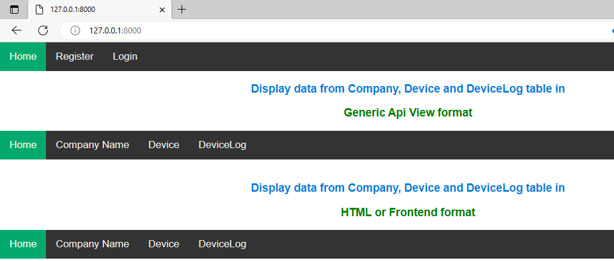
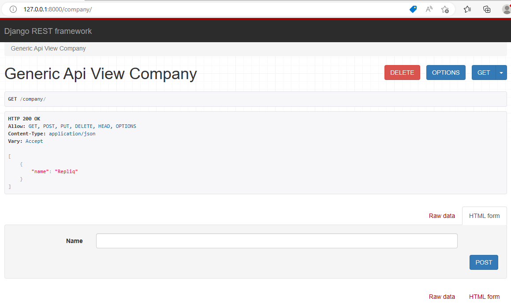
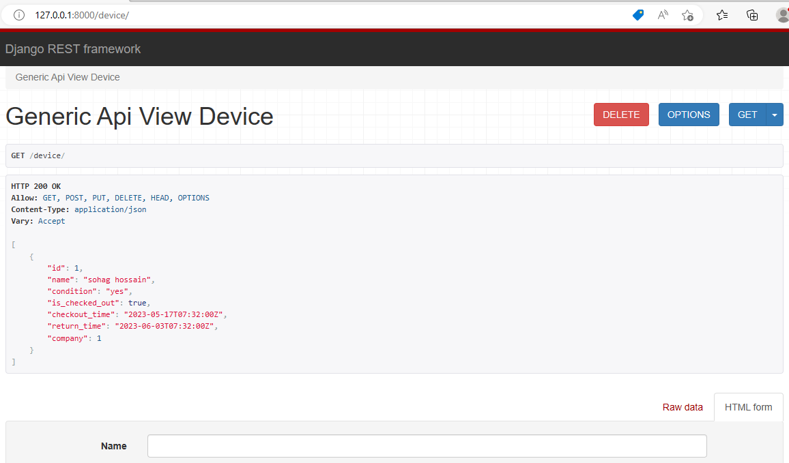
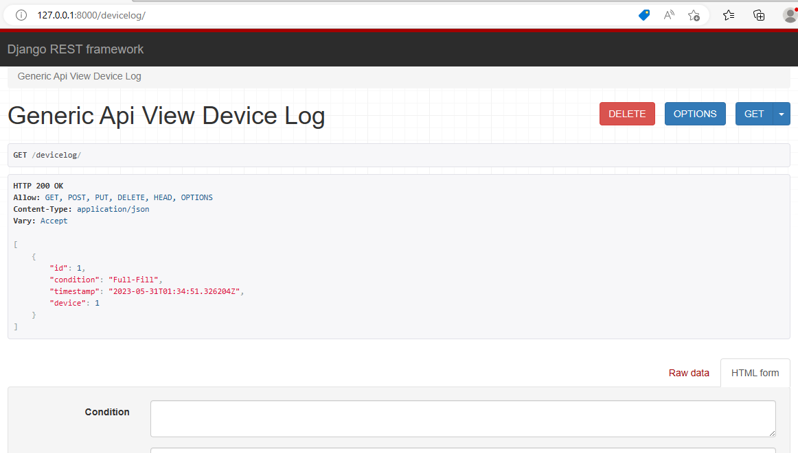
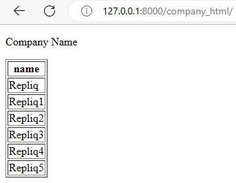
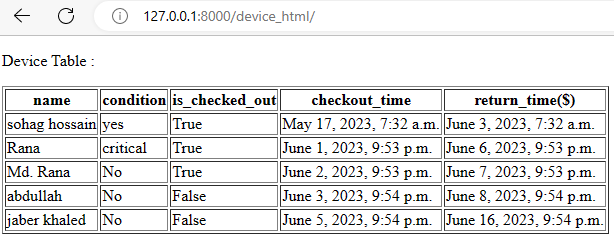
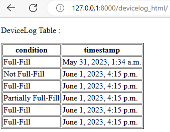

# OVERVIEW of the project
I have been hired as a developer for a new project where,
I have to write a Django app to track corporate assets such as phones, tablets, laptops 
and other gears handed out to employees.

# GOALS
The application might be used by several companies
Each company might add all or some of its employees
Each company and its staff might delegate one or more devices to employees for
a certain period of time
Each company should be able to see when a Device was checked out and returned
Each device should have a log of what condition it was handed out and returned


# Dependencies:

Django

simplejson

Django REST framework

psycopg2


# Project property
### Project Name : Track_Gadget 
It is used to manage all apps
### Apps Name : Accounts and Employee
Here Accounts app is responsible for signup, signin and logout.

Employee app is responsible for monitoring employee.

# Datbase Connection

```bash
    DATABASES = {
    'default': {
        'ENGINE': 'django.db.backends.postgresql',
        'NAME': 'backend',
        'USER':'postgres',
        'PASSWORD':'1234',
        'HOST':'localhost',
        'PORT':'5432'
    }
}
```

# Propagating changes of models

```bash
  python manage.py makemigrations
  python manage.py migrate 
```

# Declaring Model 

For company table
```bash
  class Company(models.Model):
    name = models.CharField(max_length=100)
```

For Device table
```bash
  class Device(models.Model):
    name = models.CharField(max_length=100)
    condition = models.TextField()
    is_checked_out = models.BooleanField(default=False)
    checkout_time = models.DateTimeField(null=True, blank=True)
    return_time = models.DateTimeField(null=True, blank=True)
    company = models.ForeignKey(Company, on_delete=models.CASCADE)
```

For DeviceLog table
```bash
  class DeviceLog(models.Model):
    device = models.ForeignKey(Device, on_delete=models.CASCADE)
    condition = models.TextField()
    timestamp = models.DateTimeField(auto_now_add=True)
```


# Declaring Model serializers

For company table
```bash
  class CompanySerializer(serializers.ModelSerializer):
    class Meta:
        model = Company
        fields = ['name']
```

For Device table
```bash
  class DeviceSerializer(serializers.ModelSerializer):
    class Meta:
        model = Device
        fields = '__all__'
```

For DeviceLog table
```bash
  class DeviceLogSerializer(serializers.ModelSerializer):
    class Meta:
        model = DeviceLog
        fields = '__all__'
```


# GenericAPIView Company table

For company table
```bash
  class GenericApiView_Company(generics.GenericAPIView, 
                     mixins.ListModelMixin,
                     mixins.CreateModelMixin,
                     mixins.UpdateModelMixin,
                     mixins.RetrieveModelMixin,
                     mixins.DestroyModelMixin):
    queryset=Company.objects.all()
    serializer_class=CompanySerializer
    lookup_field="id"

    #https://www.django-rest-framework.org/tutorial/3-class-based-views/
    def get(self,request,id=None):
        if id:
            return self.retrieve(request,id)
        else:
            return self.list(request)
        
    def post(self,request):
        return self.create(request)
    
    def put(self,request,id=None):
        return self.update(request,id)
    
    def delete(self,request,id=id):
        return self.destroy(request,id)
```


# GenericAPIView Device table

For company table
```bash
  class GenericApiView_Device(generics.GenericAPIView, 
                     mixins.ListModelMixin,
                     mixins.CreateModelMixin,
                     mixins.UpdateModelMixin,
                     mixins.RetrieveModelMixin,
                     mixins.DestroyModelMixin):
    queryset=Device.objects.all()
    serializer_class=DeviceSerializer
    lookup_field="id"

    #https://www.django-rest-framework.org/tutorial/3-class-based-views/
    def get(self,request,id=None):
        if id:
            return self.retrieve(request,id)
        else:
            return self.list(request)
        
    def post(self,request):
        return self.create(request)
    
    def put(self,request,id=None):
        return self.update(request,id)
    
    def delete(self,request,id=id):
        return self.destroy(request,id)
```

# GenericAPIView DeviceLog table

For company table
```bash
  class GenericApiView_DeviceLog(generics.GenericAPIView, 
                     mixins.ListModelMixin,
                     mixins.CreateModelMixin,
                     mixins.UpdateModelMixin,
                     mixins.RetrieveModelMixin,
                     mixins.DestroyModelMixin):
    queryset=DeviceLog.objects.all()
    serializer_class=DeviceLogSerializer
    lookup_field="id"

    #https://www.django-rest-framework.org/tutorial/3-class-based-views/
    def get(self,request,id=None):
        if id:
            return self.retrieve(request,id)
        else:
            return self.list(request)
        
    def post(self,request):
        return self.create(request)
    
    def put(self,request,id=None):
        return self.update(request,id)
    
    def delete(self,request,id=id):
        return self.destroy(request,id)
```

# urls.py of Employee apps

We can display single or all data from Company, Device and DeviceLog table
```bash
from Employee.views import GenericApiView_Company,GenericApiView_Device,GenericApiView_DeviceLog

urlpatterns = [
    path("", views.index, name="index"),

    path('company/',GenericApiView_Company.as_view(),name="company"),
    path('company/<int:id>/',GenericApiView_Company.as_view(),name="company"),

    path('device/',GenericApiView_Device.as_view(),name="device"),
    path('device/<int:id>/',GenericApiView_Device.as_view(),name="device"),

    path('devicelog/',GenericApiView_DeviceLog.as_view(),name="devicelog"),
    path('devicelog/<int:id>/',GenericApiView_DeviceLog.as_view(),name="devicelog"),
]
```

# Display Home page




# Display data from Company table




# Display data from Device table



# Display data from DeviceLog table



# Simple Frontend View
## Display data from Company table



## Display data from Device table



## Display data from DeviceLog table




